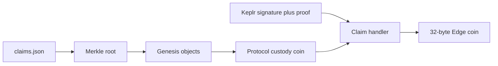

# Edge 上の RISE 請求

実装先は [sunrise-edge](https://github.com/sunriselayer/sunrise-edge) のプロトコルです。sunrise チェーンへの追加ではありません。10 月 5 日に一度だけ書き出す `claims.json` を入力にし、その後 sunrise は停止します。請求の照合とコインの分割は Edge 上で完結します。USDC と ATOM は、sunrise でも Edge でもなく、別リポジトリの出金サービスが払います。

genesis に置けるオブジェクトは [`MAX_GENESIS_OBJECTS = 32`](/home/user/github.com/sunrise-zone/sunrise-edge/crates/node-core/src/genesis.rs) までです。利用者ごとのコインは置けません。RISE は保管コイン 1 枚にまとめ、誰の分かは Merkle 根で固定します。

## 固定するデータ

sunrise の `claims.json` から、`asset=rise` の行だけを `(sunrise の 20 バイト, claimable_at)` ごとに合計します。出所の行は監査用に JSON へ残し、葉には入れません。合計が `u64` を超えたら根の生成を失敗させます。

葉は claimant、`claimable_at`、金額です。葉と内部ノードでハッシュの入力を分け、左右はソートして sha256 します。根と、sunrise 側と同じ台帳ファイルの sha256、スナップショット時刻を 1 つの commitment オブジェクトに置きます。

保管コインは [`StandardAssetCoinV1`](/home/user/github.com/sunrise-zone/sunrise-edge/crates/standard-assets/src/lib.rs) で、所有者は [`Owner::ProtocolCustody`](/home/user/github.com/sunrise-zone/sunrise-edge/crates/objects/src/lib.rs) の新しい purpose です。秘密鍵はありません。既存の exhaustive match は、請求ハンドラ以外では拒否します。モデルは [`fee_claims.rs`](/home/user/github.com/sunrise-zone/sunrise-edge/crates/node-core/src/fee_claims.rs) の、protocol custody から split する経路です。

genesis に置くのは RISE の資産定義、treasury cap、保管コイン、commitment です。実ネットワークの金額と根は、高さ 6,504,000 の `claims.json` ができた後に CLI で作ります。この変更には本番の数値を含めません。

## 請求

署名文は sunrise の `claimpayout` と同じ ADR-036 です。canonical JSON は `amount`、`asset`、`claimant`、`destination`、`ledger_sha256`、`nonce` の順です。`asset` は `rise`、`destination` は 32 バイトの Edge 住所、`ledger_sha256` は commitment と一致します。

Edge の `crypto` には secp256k1 の検証がまだありません。所有者方式にはせず、圧縮公開鍵から Cosmos の 20 バイトを復元する検証だけを足します。公開鍵の住所が葉の claimant と一致し、署名が ADR-036 の sign doc と一致する必要があります。

1 回の請求は葉を 1 枚だけ使います。証明でその葉が根に含まれることを確認し、署名の金額が、その葉の未消費額以下であることを確認します。nonce は claimant ごとに一度だけです。合格したら保管コインを減らし、宛先の 32 バイト住所が所有するコインを作ります。

## ロックの期限

Edge の実行が信頼できる現在時刻を持っていません。consensus の `Tick` はローカルの観測であり、合意された時刻ではありません。この実装では、commitment に書いたスナップショット時刻以前の葉だけを支払います。それより未来の `claimable_at` を持つロック中の RISE は同じ木に残しますが、certified clock を足す後続の変更まで請求できません。

## テスト

Go の `CanonicalBytes` と `SignDocBytes` が出すバイト列を Rust のテストベクタにします。正しい証明と署名で保管コインが減り、宛先のコインが増えること、nonce の再送、誤った証明、残高超過、スナップショットより未来の葉が拒否されることを確認します。
