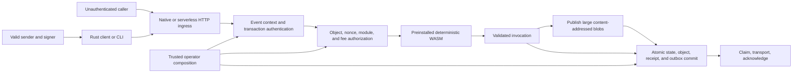

# Sunrise Edge Threat Model

This is the reusable repository threat model for security review. It describes
implemented As-Is behavior and explicitly identified deferred surfaces; it is
not a vulnerability report, production-readiness claim, or audit result. Each
audit must bind a copy to the immutable revision defined in
[`initial-code-audit-scope.md`](initial-code-audit-scope.md).

## 1. Overview

Sunrise Edge is a deterministic blockchain state machine over authenticated
events and explicit persistent state. The protocol core is intended not to
depend on a daemon, persistent connection, scheduler, transport, or cloud
provider for safety (`README.md:3-15`, `README.md:40-62`).

The concrete executable node profile in this repository is a loopback-only,
single-validator devnet. It composes native HTTP, authenticated
`SubmitTransaction`, a trusted preinstalled Standard Asset v1 whole-coin
transfer WASM module, ordinary coin-denominated asset fees, separate local
SQLite structured/blob stores, and a bounded
process-local outbound queue (`apps/devnet/src/config.rs:23-34`,
`apps/devnet/src/main.rs:16-129`, `apps/devnet/src/composition.rs:42-99`). It is
not a production node.

### Components

| Component | As-Is responsibility and evidence |
| --- | --- |
| Canonical/crypto foundation | Versioned deterministic framing, domain-separated hash/signature inputs, active hash-suite selection, and Ed25519 verification (`crates/canonical-encoding/src/lib.rs:11-139`, `crates/hashing/src/lib.rs:96-151`, `crates/crypto/src/lib.rs:118-208`). |
| Node core | Closed event kinds, context validation, transaction authentication, replay/nonce handling, object authorization/effect validation, module/fee composition, and durable invocation assembly (`crates/node-core/src/lib.rs:1280-1469`, `crates/node-core/src/transaction_auth.rs:288-348`, `crates/node-core/src/lib.rs:4000-4286`). |
| Execution | Fresh `wasmi` instance per call, fuel metering, bounded inputs/outputs, and access-mode-gated host writes/consumes (`crates/execution/src/wasm_engine.rs:50-81`, `crates/execution/src/wasm_engine.rs:286-338`, `crates/execution/src/wasm_engine.rs:513-637`). |
| Runtime/persistence | Bounded all-or-none invocation contract, explicit fencing/deadlines/ambiguity, SQLite local implementation, and PostgreSQL serializable implementation (`crates/runtime/src/lib.rs:188-215`, `crates/runtime/src/lib.rs:1967-2078`, `crates/runtime/src/lib.rs:2612-2682`, `crates/runtime-sqlite/src/structured.rs:1981-2065`, `crates/runtime-postgres/src/lib.rs:2823-2954`). |
| Native HTTP | Bounded routes/admission, trusted request authority, authentication-before-storage, submit-only external event policy, and coarse no-store errors (`crates/native-http/src/lib.rs:67-108`, `crates/native-http/src/lib.rs:738-917`, `crates/native-http/src/lib.rs:2203-2263`, `crates/native-http/src/lib.rs:2410-2545`). |
| Rust client/CLI | Bounded loopback and server-authenticated TLS transports, separate expected-protocol-context verification, transaction construction, and final signature verification (`clients/rust/src/transport.rs:351-448`, `clients/rust/src/transport.rs:461-643`, `clients/rust/src/context.rs:1-23`, `clients/rust/src/transaction.rs:177-286`). |
| Serverless adapters | Bounded HTTP envelope relays to a separate node-core capability; they do not implement node state, transaction authentication, deduplication, or outbox persistence (`adapters/shared/web-ingress.ts:31-114`, `adapters/cloudflare-workers/README.md:3-12`). Production deployment controls remain deferred. |

### Effective resources and capabilities

| Deployment or workflow | Resource or capability | Effective value/location and authority | Enforcing control | Evidence or unknowns |
| --- | --- | --- | --- | --- |
| Local devnet | HTTP listener | Required `--listen` `SocketAddr`; only loopback is accepted | Config validation before `TcpListener::bind` | `apps/devnet/src/config.rs:75-120`, `apps/devnet/src/main.rs:86-124` |
| Local devnet | Structured state | `<--data-dir>/structured.sqlite3`; devnet process reads/writes one chain/validator/domain namespace | SQLite transaction plus persisted writer fence | `apps/devnet/src/boot.rs:12-20`, `apps/devnet/src/boot.rs:80-115` |
| Local devnet | Object blobs | `<--data-dir>/blobs.sqlite3`; separate insert-if-absent content-addressed file | Digest-key conflict rejects; no independent writer fence | `apps/devnet/src/boot.rs:14-19`, `crates/runtime-sqlite/src/blob.rs:111-206`; GC/capacity is deferred |
| Local devnet | Executable module | `apps/devnet/modules/standard_asset_transfer.wasm`, embedded and catalogued as module version 1 (Standard Asset v1 whole-coin transfer, DR-0107) | Code/manifest/semantics digests are recomputed from trusted composition | `apps/devnet/src/standard_asset.rs:79-80`, `apps/devnet/src/catalog.rs:39`, `apps/devnet/src/catalog.rs:202-296` |
| Local CLI | Development signing seed | Explicit `--seed-file`; exact 32-byte hex seed | Symlink/regular-file/permission/inode checks on Unix and bounded read | `apps/cli/src/seed.rs:105-167`; non-Unix permission/inode checks are absent and this is not a keystore |
| Remote CLI | TLS trust | Literal endpoint plus explicit DNS name and one CA DER file, capped at 16 KiB | rustls server authentication, hostname verification, fixed timeouts; no mTLS/system roots/redirect/retry/proxy | `apps/cli/src/net.rs:100-203`, `clients/rust/src/transport.rs:461-594` |
| Deno/Vercel/Supabase/AWS relay | Node-core capability | Exact `SUNRISE_NODE_CORE_URL` `/v1/events` endpoint plus `SUNRISE_NODE_CORE_BEARER_TOKEN` | HTTPS, ASCII token validation, redirect rejection, bounded timeout | `adapters/shared/authenticated-node-core.ts:6-107`; provisioning, rotation, and downstream enforcement are deployment assumptions |
| Cloudflare relay | Node-core capability | `NODE_CORE` Service Binding to `sunrise-edge-node-core` | Provider Service Binding | `adapters/cloudflare-workers/src/index.ts:12-19`, `adapters/cloudflare-workers/wrangler.jsonc:7-16`; actual target exposure is not proven by source |
| PostgreSQL library | Durable database | Caller-supplied `postgres::Config`, TLS connector, pool policy, and chain/validator/domain namespace | Bounded pool, caller deadline, serializable transaction, writer fence | `crates/runtime-postgres/src/lib.rs:75-114`, `crates/runtime-postgres/src/lib.rs:189-220`, `crates/runtime-postgres/src/lib.rs:277-321`; no production node composition is established here |

## 2. Threat Model, Trust Boundaries, and Assumptions

### Protected assets and objectives

- Sender and validator signing authority, development seeds, optional hardware
  approvals, relay Bearer capabilities, and TLS trust anchors.
- Canonical bytes, stable identifiers and domains, protocol configuration,
  preinstalled code/semantics, and historical digest compatibility.
- Object heads and immutable versions, owners, balances, nonces, receipts,
  outbox records, writer generations, and the integrity of committed history.
- Availability under bounded parsing, hashing, WASM execution, persistence,
  transport, and concurrency work.

The controlling invariants are defined in [`SECURITY.md`](../../SECURITY.md).
In particular, authentication must precede runtime identity/storage,
authorization must remain within the signed manifest, and nonce/state/object/
receipt/outbox effects must commit atomically.

### Actors and starting capabilities

- An unauthenticated caller controls request bytes, timing, duplication,
  ordering, public query selectors, and demand on exposed admission capacity.
- A valid sender additionally controls every signed transaction field and owns
  its private signing authority, but does not thereby control another owner,
  operator composition, the database, or release infrastructure.
- Relays, schedulers, transports, and cloud providers can drop, duplicate,
  delay, reorder, replay, or mutate messages. They are not protocol-safety
  trust roots (`README.md:148-151`).
- An operator controls protocol configuration, hash schedule, placement,
  preinstalled catalog, fee treasury/composer, checkpoint, writer fence,
  persistence namespace, clock/identity sources, and deployment credentials.
  Those are trusted composition inputs, not attacker starting capabilities
  (`crates/native-http/src/lib.rs:74-125`,
  `apps/devnet/src/composition.rs:26-99`).

### Boundary 1: caller to HTTP ingress

Native and shared Web ingress enforce exact route/method/media/encoding rules
and bounded bodies (`crates/native-http/src/lib.rs:1389-1444`,
`adapters/shared/web-ingress.ts:31-189`). Native synchronous work is protected
by an explicit semaphore with immediate overload rejection
(`crates/native-http/src/lib.rs:314-360`,
`crates/native-http/src/lib.rs:1503-1571`). The repository-owned native server
also acquires a separate bounded connection permit before HTTP parsing and
enforces finite header/body reads, finite response-write idle and total time,
and one request per connection (DR-0100).
Devnet GET queries are intentionally
unauthenticated public reads and share that admission pool with submissions
(`apps/devnet/src/config.rs:23-34`).

### Boundary 2: ingress to authenticated transaction

The structured native path decodes a canonical event, rejects non-submit
families, validates chain/version/epoch, and verifies the transaction before it
allocates runtime identity, reads the clock, or touches storage
(`crates/native-http/src/lib.rs:2410-2464`). Authentication resolves the
committed profile, bounds signable bytes, binds the signature domain, and uses
the sender's exact public-key bytes for Ed25519 verification
(`crates/node-core/src/transaction_auth.rs:288-348`).

### Boundary 3: authenticated sender to object/module/fee authority

Signed references must match the current head and immutable version; object
chain provenance and inline/blob body digests are independently verified
(`crates/node-core/src/lib.rs:4536-4700`). Address-owned mutation defaults to
the sender. The only cross-owner destination relaxation is an exact committed
entrypoint/index/mode/type/schema policy; the fee treasury is an exact final
write selected by trusted composition (`crates/node-core/src/lib.rs:4703-4748`).
Effects must match signed Read/Write/Consume modes, and updates preserve
owner/type/schema while incrementing version exactly once
(`crates/node-core/src/authenticated_object_effects.rs:181-268`,
`crates/node-core/src/authenticated_object_effects.rs:387-495`).

The caller supplies a module reference, not executable bytes. The active
devnet module and semantics are reconstructed from trusted catalog and protocol
configuration (`apps/devnet/src/catalog.rs:186-289`).

### Boundary 4: execution to durable state

Exact receipt replay returns before nonce, module, object, or application work;
request-ID reuse with a different event digest rejects; fresh submissions must
match the exact next nonce (`crates/node-core/src/lib.rs:4035-4095`). The node
then assembles state, object, receipt, and outbox sections in one bounded
invocation and reports success only after commit
(`crates/node-core/src/lib.rs:4223-4286`).

SQLite validates its bound namespace, deadline, fence, receipt absence, state
and object reads inside one `BEGIN IMMEDIATE` transaction
(`crates/runtime-sqlite/src/structured.rs:1981-2065`). PostgreSQL performs the
same categories inside one serializable transaction
(`crates/runtime-postgres/src/lib.rs:2823-2954`). Post-dispatch ambiguity is a
distinct outcome that must be reconciled by persisted request identity rather
than blindly replayed (`crates/runtime/src/lib.rs:2612-2682`).

### Boundary 5: structured commit to blobs and outbound delivery

Blob publication occurs after complete envelope validation but before the
structured commit (`crates/node-core/src/lib.rs:4213-4272`). Content-addressed
put is insert-if-absent and conflicting bytes cannot overwrite an existing
digest (`crates/runtime/src/lib.rs:3097-3119`). A later structured rejection may
therefore leave unreachable content, but not a partial structured state commit;
garbage collection is deferred (`crates/node-core/src/lib.rs:4395-4405`,
`apps/devnet/src/boot.rs:71-79`).

Outbound delivery claims the request's exact persisted message, validates its
lease identity and canonical context, sends, then acknowledges
(`crates/native-http/src/lib.rs:2495-2540`). The concrete devnet transport is a
bounded process-local queue, not a network relay
(`apps/devnet/src/transport.rs:6-49`).

### Boundary 6: client to transport and signer

Plaintext client transport is loopback-only. Remote transport authenticates one
explicit DNS name against one caller-supplied CA and is independently bounded
(`clients/rust/src/transport.rs:351-448`,
`clients/rust/src/transport.rs:461-643`). TLS proves endpoint identity, not the
intended chain: the client separately compares locally trusted chain, version,
epoch, hash suite, authentication profile, signature scheme, address binding,
and domain before later queries or signing (`clients/rust/src/context.rs:1-23`,
`clients/rust/src/context.rs:160-217`,
`apps/cli/src/commands/transfer.rs:345-452`). Full canonical `ProtocolConfig`
byte pinning remains deferred.

### Assumptions and explicit unknowns

- Ed25519, SHA-2/SHA-3, rustls, wasmi, SQLite, and PostgreSQL implementations
  behave according to their locked dependencies and platform contracts. This
  model does not grant an attacker an already-compromised primitive.
- Sender/operator keys and credentials are provisioned and protected outside
  request authority. Local seed handling is development-only
  (`clients/rust/src/key.rs:1-24`).
- SQLite runs on durable local storage with correct shared-memory semantics;
  network filesystems and ephemeral disks are unsupported
  (`crates/runtime-sqlite/src/lib.rs:3-15`).
- Production PostgreSQL TLS, credentials, topology, migrations, fencing
  orchestration, backup/restore, HA, and monitoring are caller/operator duties;
  the library alone does not prove them (`crates/runtime-postgres/src/lib.rs:189-215`).
- Serverless source does not prove deployed caller authorization, private
  connectivity, token lifecycle, rate/WAF policy, or downstream node-core
  enforcement (`adapters/shared/README.md:17-22`,
  `adapters/aws-lambda/README.md:33-38`).
- The devnet remains loopback-only and does not custody real assets
  (`README.md:102-115`).
- Physical Ledger/HIL/release behavior and production activation of other
  event families are deferred, not modeled as implemented controls
  (`TODO.md:1778-1783`, `TODO.md:2275-2286`).

## 3. Attack Surface, Mitigations, and Attacker Stories

Every row below is a **hypothesis for review**, not a confirmed vulnerability.
Priority indicates review order based on possible impact and reachability, not
a severity finding.

| Priority | Hypothesis: scenario and capability gain | Prerequisites | Impact if the control fails | Existing controls | Review/mitigation focus and evidence |
| --- | --- | --- | --- | --- | --- |
| P0 | H-1: forge, confuse, or replay a transaction across chain/version/epoch/profile boundaries to gain another sender's mutation authority | Reachable structured submit route and a framing/profile verification defect | Unauthorized asset/state mutation or cross-chain signing | Central canonical and signature-domain framing; trusted context/profile resolution; Ed25519 sender binding | Check every encode/decode/domain field and negative vector; `crates/crypto/src/lib.rs:118-208`, `crates/node-core/src/transaction_auth.rs:288-348` |
| P0 | H-2: reuse one request ID or nonce so one signed intent causes a second mutation or fee | Duplicate/reordered delivery plus dedup/atomicity defect | Duplicate transfer, fee, receipt, or durable-history divergence | Receipt/event-digest check precedes nonce/app work; exact next nonce; atomic invocation | Trace normal, conflicting, and indeterminate commits across both stores; `crates/node-core/src/lib.rs:4035-4095`, `crates/runtime/src/lib.rs:2669-2682` |
| P0 | H-3: obtain mutation authority over an undeclared, stale, foreign-owned, Shared/System, or treasury object | Valid sender plus object loader/effect-policy mismatch | Unauthorized balance movement or object corruption | Exact ref/head/version/digest/provenance checks; sender/policy authorization; exact effect matching | Review cross-owner destination and treasury exceptions as distinct capabilities; `crates/node-core/src/lib.rs:4499-4758`, `crates/node-core/src/authenticated_object_effects.rs:181-268` |
| P0 | H-4: cause a partially committed state/object/nonce/receipt/outbox transaction or misclassify an ambiguous commit | Backend error, conflict, timeout, cancellation, connection loss, or adapter mapping defect | Durable-history corruption or duplicate effects after retry | Typed all-or-none envelope; transactional SQLite/PostgreSQL mappings; explicit Indeterminate outcome | Verify every pre/post-commit error classification and reconciliation path; `crates/runtime/src/lib.rs:1967-2078`, `crates/runtime-postgres/src/lib.rs:2823-2954` |
| P1 | H-5: substitute executable WASM or committed semantics, or escape signed access through a host call | Valid sender plus catalog/host binding defect | Arbitrary module execution or unauthorized object effects | Preinstalled catalog with recomputed digests; fuel; host access-mode checks; post-execution effect validation | Verify module-ref resolution, semantics hash binding, imports, memory access, traps, and effect materialization; `apps/devnet/src/catalog.rs:186-289`, `crates/execution/src/wasm_engine.rs:181-212`, `crates/execution/src/wasm_engine.rs:513-637` |
| P1 | H-6: manipulate actual-gas or rejected-result fee composition to debit the wrong payer, redirect treasury, overcharge, mint, or lose value | Valid signed fee declaration plus gas/composer/atomicity defect | Unauthorized fee or supply change | Treasury is composition-selected and hidden from WASM; checked debit/credit; fee effects share invocation atomicity | Review success/trap/insufficient/overflow/replay paths; `apps/devnet/src/catalog.rs:66-85`, `apps/devnet/src/fee.rs:18-59`, `crates/node-core/src/lib.rs:4114-4121` |
| P1 | H-7: bypass the submit-only external boundary and deliver vote/certificate/governance/upgrade/validator-set/Tick without family authentication | Exposed native route plus event-kind classification/routing defect | Unauthorized consensus or administrative transition | Exhaustive external rejection before side effects | Confirm all router families and future enum additions remain classified; `crates/native-http/src/lib.rs:2203-2263` |
| P1 | H-8: make remote CLI sign for an attacker-selected chain despite a valid TLS session | User invokes remote mode and endpoint/context checks diverge or occur too late | Cross-chain or wrong-protocol signed transaction | Explicit CA/name TLS plus separate locally expected context before nonce/object/signing | Review every network command and all context fields; full config-byte pinning remains an explicit gap; `clients/rust/src/context.rs:1-23`, `apps/cli/src/commands/transfer.rs:379-452` |
| P2 | H-9: exhaust CPU, memory, sockets, database connections/locks, WASM memory, or the shared query/submission pool with slow or expensive work | Exposed endpoint and sufficient request/connection rate | Bounded but material service unavailability | Pre-parser connection cap; finite header/body reads; one request per connection; body/object/output/fuel/deadline/pool/concurrency bounds and immediate post-parse 429 | Re-test DR-0100 under the selected production proxy/kernel topology and measure effective budgets; separately confirm whether wasmi linear-memory growth has an enforceable host cap beyond fuel because the inspected engine uses `Config::default()` plus fuel (`crates/execution/src/wasm_engine.rs:535-569`). |
| P2 | H-10: exploit blob/structured ordering to substitute content, create partial state, or consume storage with unreachable blobs | Ability to drive large object updates and repeated later commit rejection | Integrity violation or storage exhaustion | Digest verification and conflict-no-overwrite; publication only after envelope validation; structured transaction remains atomic | Prove no reference can commit without its blob and quantify orphan controls before production; `crates/node-core/src/lib.rs:4213-4272`, `crates/runtime/src/lib.rs:3097-3119` |
| P2 | H-11: steal or redirect relay capability through URL parsing, redirects, logs, or deployment misconfiguration | Possession/influence over provider environment or public deployment prerequisite | Unauthorized downstream invocation or secret disclosure | Exact HTTPS path, no URL credentials/query/fragment, ASCII bounded token, redirect error, coarse logs | Source establishes client-side restrictions only; validate real secret rotation, node-core Bearer enforcement, network policy, and logs in a deployment audit; `adapters/shared/authenticated-node-core.ts:41-107`, `adapters/shared/web-ingress.ts:73-112` |
| P3 | H-12: read a development seed through filesystem replacement or permissive metadata | Local filesystem access and platform-specific prerequisite | Development sender-key disclosure | Unix symlink, type, permission, inode, and bounded-content checks | Treat non-Unix checks and memory zeroization as known development limitations; do not elevate without a production-key deployment; `apps/cli/src/seed.rs:105-167`, `clients/rust/src/key.rs:1-24` |

Excluded or deferred features are not silently safe. A story that depends on a
production deployment, externally enabled event family, multi-validator
activation, browser client, or physical Ledger release must state that missing
prerequisite and be reviewed when the surface is introduced.

## 4. Severity Calibration

Severity is based on realistic prerequisites, actual exposure, existing
effective controls, and the new capability gained. Confidence in evidence is
separate from impact.

| Severity | Sunrise Edge calibration | Counterexamples or reductions |
| --- | --- | --- |
| Critical | Practical private-key compromise; unauthenticated arbitrary asset/state mutation; protocol-wide canonical or durable-history integrity loss under the supported boundary. | A hypothetical future mainnet impact without an implemented/reachable surface is not Critical. |
| High | Signature/profile or object-authorization bypass; cross-chain signing under a realistic remote configuration; replay causing a second mutation/fee; exploitable atomicity failure; caller substitution of arbitrary executable module code. | A defect requiring prior control of trusted protocol configuration, database administrator, or signer is not automatically High; identify the additional capability gained. |
| Medium | Bounded but meaningful availability loss, integrity degradation, or information exposure reachable under an actual supported deployment and requiring additional prerequisites. | Public devnet context/object/receipt/nonce reads are documented behavior, not a confidentiality bypass unless a new protected deployment assumption is established. |
| Low | Concrete, realistically reachable hardening weakness with limited impact, such as a small bounded leak or denial-of-service amplification. | Style issues, missing defense in depth without impact, and documentation-only disagreement are not findings by themselves. |

The following are not confirmed vulnerabilities without further evidence:

- missing production topology, WAF, rate policy, secret rotation, HA, backup, or
  PKI operations where no production deployment is claimed;
- storage or configuration changes by an attacker already assumed to be the
  trusted operator/administrator, unless they gain distinct additional
  authority;
- unreachable deferred event/module/hardware/browser surfaces; and
- resource-limit questions without a reachable path and material impact.

When a hypothesis is validated, the report must name the affected immutable
commit, source-to-sensitive-operation path, attacker prerequisites, violated
invariant, concrete impact, effective countercontrols, confidence, and the
reason for its calibrated severity.
